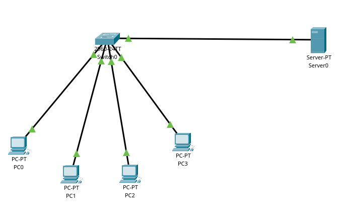
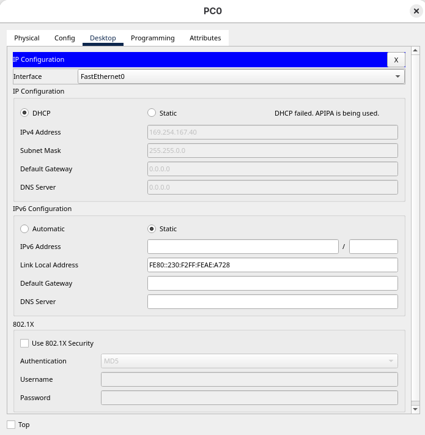
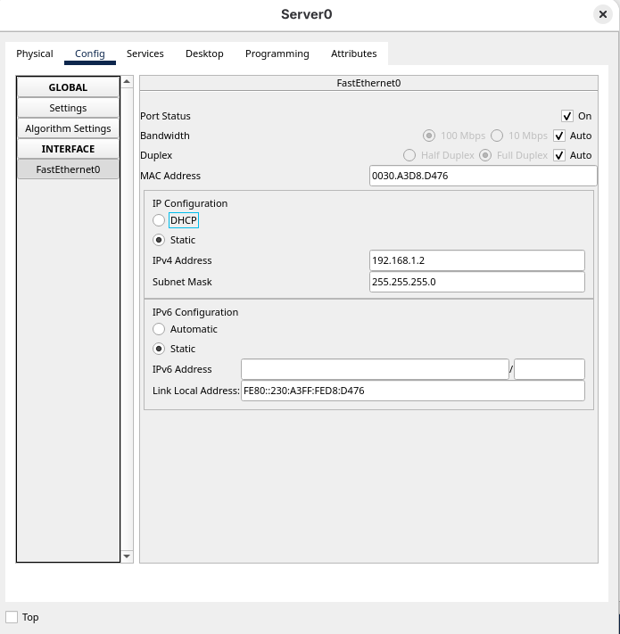
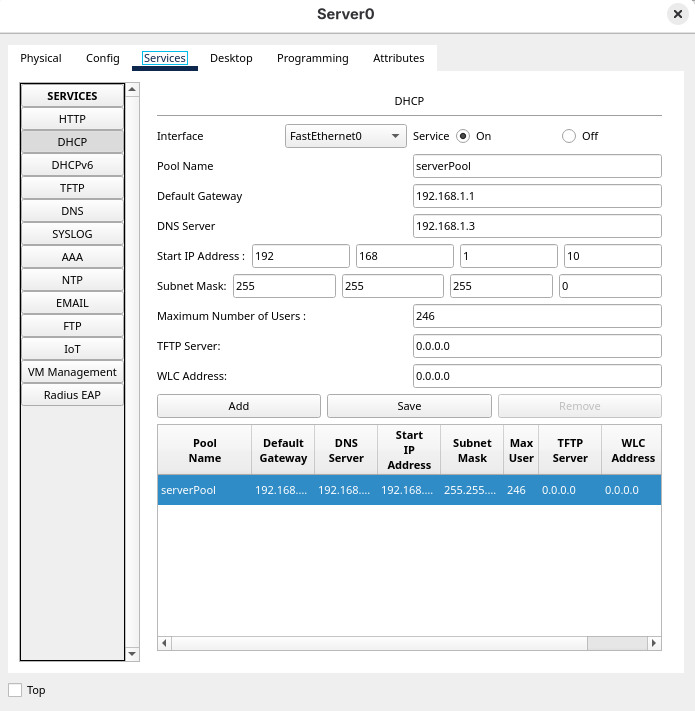
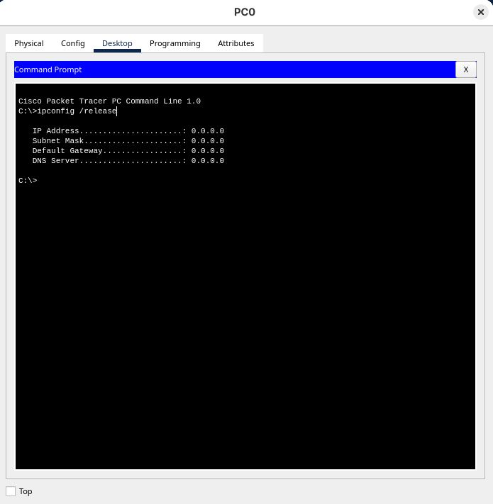
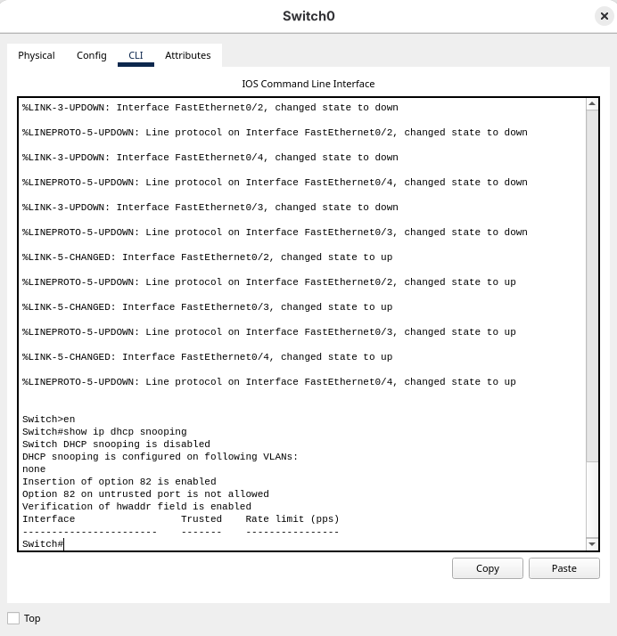
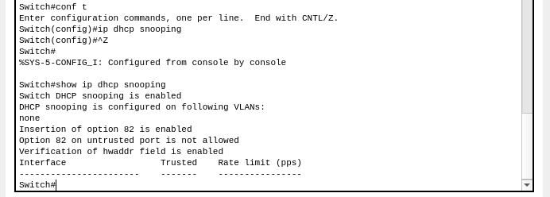
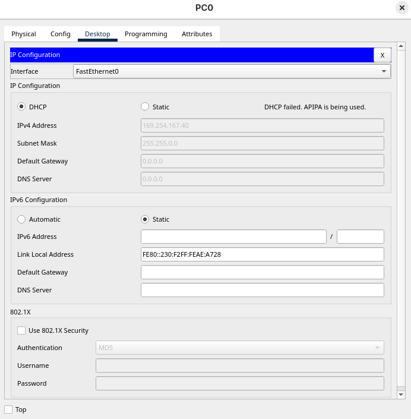
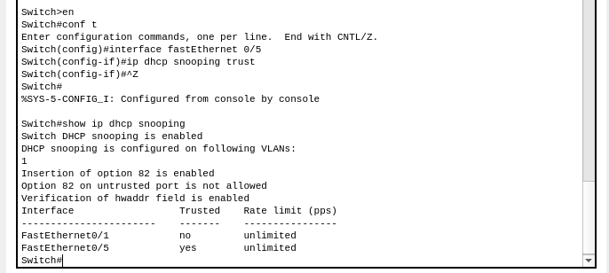
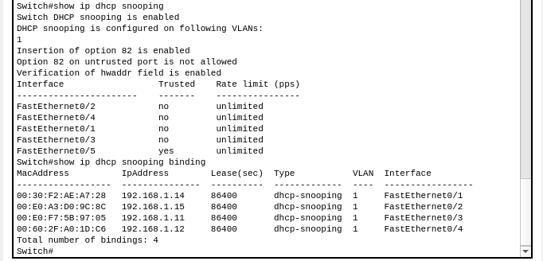

# آزمایش شماره‌ی ۸ - DHCP snooping

- گروه شماره ۱
    - معین آعلی - ۴۰۱۱۰۵۵۶۱
    - ملیکا علیزاده - ۴۰۱۱۰۶۲۵۵
    - مهدی محمدی - ۴۰۰۱۰۵۲۳۹

## بخش اول - پیاده‌سازی سناریو

ابتدا طبق سناریوی داده‌شده شبکه زیر را که شامل 4 کامپیوتر و 1 سرور و یک سوییچ است را به صورت زیر می‌سازیم و با استفاده از سیم 
`Copper Cross-Over`
تمامی اجزا را متصل می‌کنیم.



چون قرار است IP کامپیوترها با استفاده از DHCP server مشخص شوند نیازی به تنظیم کردن آنها نیست و چون هنوز تنظیمات مربوط به سرور را انجام نداده‌ایم این مورد انجام نمی‌شود که در تصویر زیر آمده‌است.



حال برای سرور IP را به صورت زیر تنظیم می‌کنیم.



## بخش دوم - فعال‌کردن DHCP

بعد از تنظیم کردن IP سرور حال باید تنظیمات DHCP server را انجام دهیم. پس با کلیک بر روی سرور، در بخش Services و در سرویس DHCP با وارد کردن موارد زیر و فعال کردن گزینه‌ی on تنظیمات را انجام می‌دهیم. بعد از زدن گزینه‌ی Save این سرویس را بر روی سرور اعمال می‌کنیم.



حال باید چک کنیم که DHCP server درست کار می‌کند یا خیر. برای اینکار با کلیک بر روی یکی از کامپیوترها، در بخش Desktop و در بخش IP Configuration با انتخاب گزینه‌ی DHCP نتیجه را مشاهده می‌کنیم که با موفقیت کانفیگ انجام شده‌است و کامپیوتر IP دریافت‌ کرده‌است.  


## بخش سوم - فعال‌کردن DHCP snooping

ابتدا در بخش Desktop در Command Prompt با استفاده از دستور `ip release` در تمام کامپیوترها IP گرفته شده از DHCP server را پاک می‌کنیم.



حال باید تنظیمات سوییچ را تغییر دهیم. برای اینکار با کلیک بر روی سوییچ و در بخش CLI با استفاده از دستورات زیر ابتدا چک می‌کنیم که DHCP snooping غیرفعال باشد.

```sh
en
show ip dhcp snooping
```



حال با استفاده از دستورات زیر باید DHCP snooping را فعال کنیم. 

```sh
conf t
ip dhcp snooping
exit
```

و با استفاده از دستور زیر چک می‌کنیم که فعال شده‌است.

```sh
show ip dhcp snooping
```



در ادامه با استفاده از دستورات زیر مشخص می‌کنیم که این تنظیمات برای VLAN 1 فعال شود.

```sh
show ip dhcp snooping
```


حال با کلیک بر روی یکی از کامپیوترها، در بخش Desktop و در بخش IP Configuration با انتخاب گزینه‌ی DHCP مشاهده‌ می‌کنیم که با شکست روبرو می‌شود و IP دریافت نمی‌کند.



این موضوع به این دلیل است که تمامی پورت‌های سوییچ unsafe هستند و باید پورتی که سرور و سوییچ با هم در ارتباط هستند را trust کنیم. برای اینکار بار دیگر به CLI در سوییچ رفته و دستورات زیر را وارد می‌کنیم.  

```sh
en
conf t
interface fastEthernet 0/5
ip dhcp snooping trust
exit
```

و با دستور زیر مشاهده می‌کنیم که به درستی انجام شده‌است.

```sh
show ip dhcp snooping
```



حال بار دیگر با کلیک بر روی یکی از کامپیوترها، در بخش Desktop و در بخش IP Configuration با انتخاب گزینه‌ی DHCP مشاهده‌ می‌کنیم که IP با موفقیت دریافت شده‌است.


در آخر می‌توانیم با استفاده از دستورات زیر در سوییچ مشاهده کنیم که کدام پورت‌ها trust هستند و کدام IPها و MAC addressها به دیگری bind شده‌است.

```sh
show ip dhcp snooping
show ip dhcp snooping binding
```



